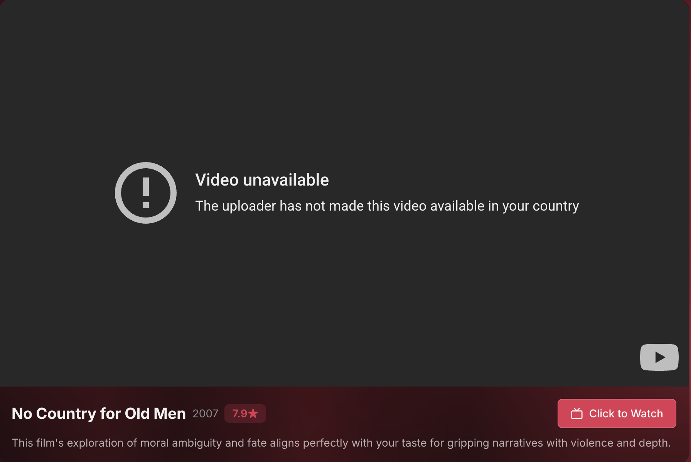

# 🎬 PickAFlick

A modern, Tinder-style movie discovery app that helps you find your next favorite film through intuitive swipe interactions and AI-powered recommendations.



## ✨ Features

- **🎯 Swipe-Based Discovery**: Tinder-style card interface for quick movie browsing
- **🎭 Mood-Based Selection**: Filter movies by genre, mood, or browse top picks
- **🤖 AI-Powered Recommendations**: Get personalized movie suggestions powered by OpenAI
- **🎥 Integrated Trailers**: Watch trailers directly in the app via YouTube integration
- **📱 Fully Responsive**: Seamless experience across desktop, tablet, and mobile devices
- **💾 Session Persistence**: Your preferences are saved as you swipe
- **🔗 Share Your Picks**: Share your movie recommendations with friends
- **📚 Watchlist**: Save movies you want to watch later

## 🛠️ Tech Stack

### Frontend
- **React** + **TypeScript** - Modern UI development
- **Vite** - Lightning-fast build tool
- **TailwindCSS** - Utility-first styling
- **Framer Motion** - Smooth animations
- **Tanstack Query** - Data fetching and caching
- **Wouter** - Lightweight routing
- **Radix UI** - Accessible component primitives

### Backend
- **Express** - Node.js web framework
- **PostgreSQL** - Reliable database
- **Drizzle ORM** - Type-safe database queries
- **OpenAI API** - AI-powered recommendations
- **TMDB API** - Movie data and metadata

## 🚀 Getting Started

### Prerequisites

- **Node.js** 18+ and npm
- **PostgreSQL** database
- **TMDB API Key** - [Get one here](https://www.themoviedb.org/settings/api)
- **OpenAI API Key** - [Get one here](https://platform.openai.com/api-keys)

### Installation

1. **Clone the repository**
   ```bash
   git clone https://github.com/OneNowTwo/PickAFlick.git
   cd PickAFlick
   ```

2. **Install dependencies**
   ```bash
   npm install
   ```

3. **Set up environment variables**
   ```bash
   cp .env.example .env
   ```
   
   Edit `.env` and add your API keys:
   ```env
   DATABASE_URL=postgresql://localhost/pickaflick
   TMDB_API_KEY=your_tmdb_api_key
   AI_INTEGRATIONS_OPENAI_API_KEY=your_openai_api_key
   ```

4. **Set up the database**
   ```bash
   # Create the database
   createdb pickaflick
   
   # Push schema to database
   npm run db:push
   ```

5. **Start the development server**
   ```bash
   npm run dev
   ```

6. **Open your browser**
   Navigate to [http://localhost:5000](http://localhost:5000)

## 📝 Environment Variables

| Variable | Description | Required |
|----------|-------------|----------|
| `NODE_ENV` | Environment mode (`development` or `production`) | Yes |
| `PORT` | Server port (default: 5000) | No |
| `DATABASE_URL` | PostgreSQL connection string | Yes |
| `TMDB_API_KEY` | The Movie Database API key | Yes |
| `AI_INTEGRATIONS_OPENAI_API_KEY` | OpenAI API key for recommendations | Yes |
| `CATALOGUE_TTL_HOURS` | Hours to cache movie catalog (default: 24) | No |

## 🏗️ Project Structure

```
PickAFlick/
├── client/                # Frontend React application
│   ├── src/
│   │   ├── components/   # React components
│   │   ├── pages/        # Page components
│   │   ├── hooks/        # Custom React hooks
│   │   └── lib/          # Utilities and configs
│   └── public/           # Static assets
├── server/               # Backend Express application
│   ├── routes.ts        # API routes
│   ├── db.ts            # Database configuration
│   ├── tmdb.ts          # TMDB API integration
│   ├── ai-recommender.ts # OpenAI integration
│   └── index.ts         # Server entry point
├── shared/              # Shared types and schemas
│   └── schema.ts        # Zod schemas for validation
└── script/              # Build scripts
```

## 🎮 How It Works

1. **Select Your Mood**: Choose genres or moods you're interested in
2. **Start Swiping**: Swipe right on movies you like, left on ones you don't
3. **Get Recommendations**: After swiping, get AI-powered personalized recommendations
4. **Watch Trailers**: Browse and watch trailers for recommended movies
5. **Share or Save**: Share your picks with friends or add to your watchlist

## 📦 Available Scripts

```bash
# Development
npm run dev          # Start development server with hot reload

# Production
npm run build        # Build for production
npm start            # Start production server

# Database
npm run db:push      # Push schema changes to database

# Type Checking
npm run check        # Run TypeScript type checking
```

## 🚢 Deployment

### Deploy to Railway

1. **Install Railway CLI**
   ```bash
   npm install -g @railway/cli
   ```

2. **Login and initialize**
   ```bash
   railway login
   railway init
   ```

3. **Add a PostgreSQL database**
   ```bash
   railway add --plugin postgresql
   ```

4. **Set environment variables**
   ```bash
   railway variables set TMDB_API_KEY=your_key
   railway variables set AI_INTEGRATIONS_OPENAI_API_KEY=your_key
   ```

5. **Deploy**
   ```bash
   railway up
   ```

### Deploy to Render

1. Create a new Web Service on [Render](https://render.com)
2. Connect your GitHub repository
3. Configure:
   - **Build Command**: `npm install && npm run build`
   - **Start Command**: `npm start`
4. Add a PostgreSQL database
5. Set environment variables in the Render dashboard
6. Deploy!

### Deploy to Vercel (Frontend + Serverless)

Note: For Vercel deployment, you'll need to modify the backend to use serverless functions.

## 🔒 Security Notes

- ⚠️ **Never commit your `.env` file** - It contains sensitive API keys
- The `.gitignore` is configured to exclude `.env` automatically
- Create a `.env.example` file (without real values) for documentation

## 🤝 Contributing

Contributions are welcome! Please feel free to submit a Pull Request.

1. Fork the repository
2. Create your feature branch (`git checkout -b feature/AmazingFeature`)
3. Commit your changes (`git commit -m 'Add some AmazingFeature'`)
4. Push to the branch (`git push origin feature/AmazingFeature`)
5. Open a Pull Request

## 📄 License

This project is licensed under the MIT License.

## 🙏 Acknowledgments

- Movie data provided by [The Movie Database (TMDB)](https://www.themoviedb.org/)
- AI recommendations powered by [OpenAI](https://openai.com/)
- Design inspiration from Tinder's swipe interface
- UI components from [Radix UI](https://www.radix-ui.com/) and [shadcn/ui](https://ui.shadcn.com/)

## 📞 Support

If you encounter any issues or have questions, please open an issue on GitHub.

---

Made with ❤️ by the PickAFlick team
